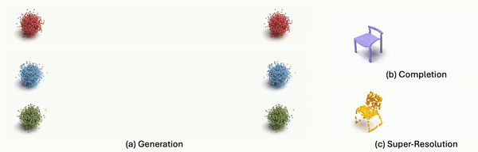
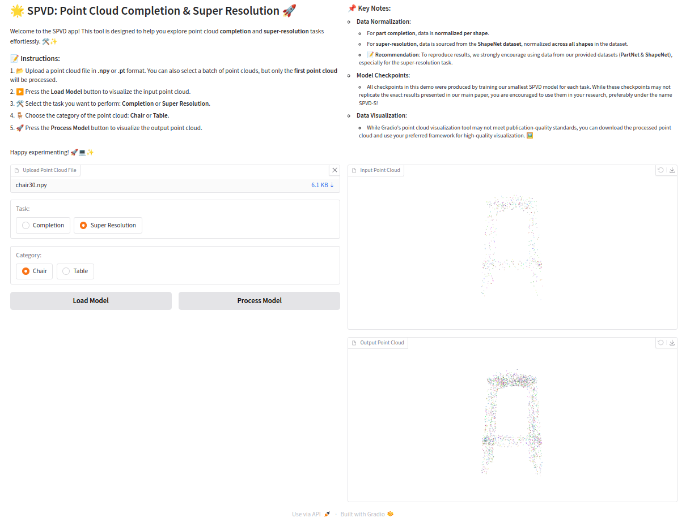

# Efficient and Scalable Point Cloud Generation with Sparse Point-Voxel Diffusion Models - TNNLS 2025


[Paper](https://arxiv.org/abs/2408.06145) | [Project Page](https://johnromanelis.github.io/_spvd/) | [Video](https://youtu.be/Ca51lMpHHms) | [Lightning Version](https://github.com/JohnRomanelis/SPVD_Lightning.git) | [Published paper (TNNLS)](https://ieeexplore.ieee.org/document/11277335)

<p align="center">
  
</p>


This repository contains the official implementation for our publication: *"Efficient and Scalable Point Cloud Generation with Sparse Point-Voxel Diffusion Models."*


# News:

- **12/8/2024**: Arxiv submission of the SPVD preprint.
- **12/9/2024**: Release of [SPVD Lightning](https://github.com/JohnRomanelis/SPVD_Lightning.git). We replace the pclab custom library with Pytorch Lightning ⚡
- **29/11/2024**: Release of pretrained checkpoint for point cloud completion for the SPVD smallest variant. Check the *Checkpoints* section below.
- **04/12/2024**: Release of [Gradio](https://www.gradio.app/) app 🚀 for the *Completion* and *Super-Resolution* tasks. Check the *Gradio app* section below for more information. We have also released the checkpoints for point cloud super resolution of the SPVD smallest variant.
- **08/03/2025**: Release of *Generation* checkpoints for all model variants. For more details check the *Checkpoints* section below. 
- **18/11/2025**: Our manuscript has been accepted for publication on **IEEE Transactions on Neural Network and Learning Systems (TNNLS)**

# Installation

### 1. Set Up an Anaconda Environment

We recommend using Anaconda to manage your Python environment.

```
conda create --name spvd python=3.9
conda activate spvd
```

### 2. Clone the Repository

```
git clone https://github.com/JohnRomanelis/SPVD.git
```

### 3. Install PyTorch and other Python libraries

We have tested our code with PyTorch 2.0 and CUDA 11.8. You can install the compatible version using the following command:

```
conda install pytorch==2.0.0 torchvision==0.15.0 torchaudio==2.0.0 pytorch-cuda=11.8 -c pytorch -c nvidia
```

You can also install most of the required libraries through the `requirements.txt` by running:

```bash
pip install -r requirements.txt
```

### 4. Install pclab

*pclab* is an helper library, based on the fast.ai [Practical Deep Learning-Part 2](https://course.fast.ai/Lessons/part2.html) course. 

**Note**: Make sure you have installed PyTorch before install pclab to make sure you install the correct version.

1. Clone the *pclab* repository.
```
git clone https://github.com/JohnRomanelis/pclab.git
```
2. Navigate into the *pclab* directory:
```
cd pclab
```
3. Install *pclab*. This will automatically install the required dependencies:
```
pip install -e .
```

### 5. Installing TorchSparse
1. TorchSparse depends on the [Google Sparse Hash](https://github.com/sparsehash/sparsehash.git) librabry.
   To install on ubuntu run:
```
sudo apt-get install libsparsehash-dev
```

2. Clone the torchsparse repo:
```
git clone https://github.com/mit-han-lab/torchsparse.git
```
3. Navigate into the *torchsparse* directory:
```
cd torchsparse
```
4. Install *torchsparse*:
```
pip install -e .
```


### 6. Install Chamfer Distance and Earth Mover Distance

- **Chamfer** 
1. Navigate to the SPVD/metrics/chamfer_dist directory:
```
cd SPVD/metrics/chamfer_dist
``` 
2. Run: 
```
python setup.py install --user
```

- **EMD**
1. Navigate to the SPVD/metrics/PyTorchEMD directory: 
```
cd SPVD/metrics/PyTorchEMD
```
2. Run: 
```
python setup.py install
```
3. Run:
```
cp ./build/lib.linux-x86_64-cpython-310/emd_cuda.cpython-310-x86_64-linux-gnu.so .
```
If an error is raised in this last command, list all directories inside build and replace the name of the derictory with the one in your pc named *lib.linux-x86_64-cpython-\**

# Experiments
You can replicate all the experiments from our paper using the notebooks provided in the `experiments` folder. Below is a catalog of the experiments featured in our paper, along with brief descriptions.

- [TrainGeneration](https://github.com/JohnRomanelis/SPVD/blob/main/experiments/TrainGeneration.ipynb): Train a generative model for unconditional point cloud generation in a single class of ShapeNet.

- [ConditionalGeneration](https://github.com/JohnRomanelis/SPVD/blob/main/experiments/ConditionalGeneration.ipynb): Train a conditional model on all categories of ShapeNet.

- [TrainCompletion](https://github.com/JohnRomanelis/SPVD/blob/main/experiments/TrainCompletion.ipynb): Train a model for part completion on PartNet.

- [SuperResolution](https://github.com/JohnRomanelis/SPVD/blob/main/experiments/SuperResolution.ipynb): Train a model for super resolution on Point Clouds. 

 A more comprehensive list, including additional comments and experiments, is available [here](https://github.com/JohnRomanelis/SPVD/blob/main/experiments/README.md).


### Note:
All the `#export` commands are used with the `utils/notebook2py.py' script, to export parts of the notebooks to *.py* scripts.

# Data

For generation, we use the same version of ShapeNet as [PointFlow](https://github.com/stevenygd/PointFlow.git). Please refer to their instructions for downloading the dataset.

For completion we use PartNet. Download the data from the official [PartNet website](https://www.shapenet.org/). To process the data check the [PartNetDataset](https://github.com/JohnRomanelis/SPVD/blob/main/experiments/PartNetDataset.ipynb) notebook.

# Checkpoints

Please find the checkpoints for point cloud **generation**, **completion** and **super resolution** at this [link](https://drive.google.com/drive/folders/1pLkapwySaJrv1eJmOCt62eRrgTY-DCo2?usp=sharing).

## Generation
You are welcome to use these checkpoints in your research! 😊

Before using the Generation checkpoints, we kindly ask that you verify their performance to ensure they function as intended. Due to the numerous experiments conducted, there is a possibility that an incorrect file may have been uploaded by mistake.

If a checkpoint is not operating as expected, feel free to open an issue. We will review it and get back to you as soon as possible—either with a corrected checkpoint or with instructions on how to use it properly.

## Completion and Super-Resolution
You are welcome to use these checkpoints in your research; simply cite them as **SPVD-S** 😊.

*Note*: These checkpoints are not the exact versions used in the paper. Instead, they are newly trained checkpoints of the SPVD smallest variant, validated to produce visually comparable results. To create the get_model partial for model instantiation, use the following code: 
```python
from functools import partial
from models.ddpm_unet_attn import SPVUnet
get_model = partial(SPVUnet, in_channels=4, voxel_size=0.1, nfs=(32, 64, 128, 256), num_layers=1, attn_chans=8, attn_start=3)
```


# Gradio app

The Gradio app is designed to make it easy for users to experiment with the results of our publication without needing to delve into the complexities of our code. Simply follow the installation instructions to set up the environment, download the [checkpoints](https://drive.google.com/drive/folders/1pLkapwySaJrv1eJmOCt62eRrgTY-DCo2?usp=sharing) and place them in the **checkpoints** folder, and, then run:

```
python app.py
```

and access the local URL displayed in your terminal.

For more detailed instructions on using the app, along with helpful notes, we highly recommend exploring the instructions provided within the app itself. 😊

Below is an image showcasing the app interface:




# Citation

If you find this work useful in your research, please consider citing:

```bibtex
@misc{romanelis2024efficientscalablepointcloud,
      title={Efficient and Scalable Point Cloud Generation with Sparse Point-Voxel Diffusion Models}, 
      author={Ioannis Romanelis and Vlassios Fotis and Athanasios Kalogeras and Christos Alexakos and Konstantinos Moustakas and Adrian Munteanu},
      year={2024},
      eprint={2408.06145},
      archivePrefix={arXiv},
      primaryClass={cs.CV},
      url={https://arxiv.org/abs/2408.06145}, 
}
```
