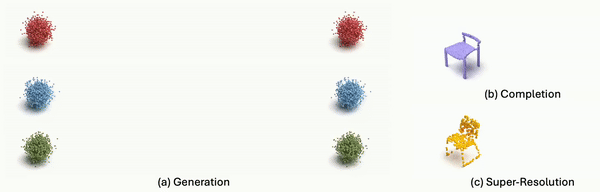

# Efficient and Scalable Point Cloud Generation with Sparse Point-Voxel Diffusion Models [[arXiv]](https://arxiv.org/abs/2408.06145)


<p align="center">
  
</p>


This repository contains the official implementation for our publication: *"Efficient and Scalable Point Cloud Generation with Sparse Point-Voxel Diffusion Models."*

Installation instructions and documention coming soon! 

# News:

- **12/8/2024**: Arxiv submission of the SPVD preprint.

# Installation

### 1. Set Up an Anaconda Environment

We recommend using Anaconda to manage your Python environment.

```
conda create --name spvd python=3.9
conda activate spvd
```

### 2. Clone the Repository

```
git clone https://github.com/JohnRomanelis/SPVD.git
```

### 3. Install PyTorch

We have tested our code with PyTorch 2.0 and CUDA 11.8. You can install the compatible version using the following command:

```
conda install pytorch==2.0.0 torchvision==0.15.0 torchaudio==2.0.0 pytorch-cuda=11.8 -c pytorch -c nvidia
```

### 4. Install pclab

*pclab* is an helper library, based on the fast.ai [Practical Deep Learning-Part 2](https://course.fast.ai/Lessons/part2.html) course. 

**Note**: Make sure you have installed PyTorch before install pclab to make sure you install the correct version.

1. Clone the *pclab* repository.
```
git clone https://github.com/JohnRomanelis/pclab.git
```
2. Navigate into the *pclab* directory:
```
cd pclab
```
3. Install *pclab*. This will automatically install the required dependencies:
```
pip install -e .
```

### 5. Installing TorchSparse
1. TorchSparse depends on the [Google Sparse Hash](https://github.com/sparsehash/sparsehash.git) librabry.
   To install on ubuntu run:
```
sudo apt-get install libsparsehash-dev
```

2. Clone the torchsparse repo:
```
git clone https://github.com/mit-han-lab/torchsparse.git
```
3. Navigate into the *torchsparse* directory:
```
cd torchsparse
```
4. Install *torchsparse*:
```
pip install -e .
```


### 6. Install Chamfer Distance and Earth Mover Distance

- **Chamfer** 
1. Navigate to the SPVD/metrics/chamfer_dist directory:
```
cd SPVD/metrics/chamfer_dist
``` 
2. Run: 
```
python setup.py install --user
```

- **EMD**
1. Navigate to the SPVD/metrics/PyTorchEMD directory: 
```
cd SPVD/metrics/PyTorchEMD
```
2. Run: 
```
python setup.py install
```
3. Run:
```
cp ./build/lib.linux-x86_64-cpython-310/emd_cuda.cpython-310-x86_64-linux-gnu.so .
```
If an error is raised in this last command, list all directories inside build and replace the name of the derictory with the one in your pc named *lib.linux-x86_64-cpython-\**

# Experiments
You can replicate all the experiments from our paper using the notebooks provided in the `experiments` folder. Below is a catalog of the experiments featured in our paper, along with brief descriptions.

- [TrainGeneration](https://github.com/JohnRomanelis/SPVD/blob/main/experiments/TrainGeneration.ipynb): Train a generative model for unconditional point cloud generation in a single class of ShapeNet.

- [ConditionalGeneration](https://github.com/JohnRomanelis/SPVD/blob/main/experiments/ConditionalGeneration.ipynb): Train a conditional model on all categories of ShapeNet.

- [TrainCompletion](https://github.com/JohnRomanelis/SPVD/blob/main/experiments/TrainCompletion.ipynb): Train a model for part completion on PartNet.

- [SuperResolution](https://github.com/JohnRomanelis/SPVD/blob/main/experiments/SuperResolution.ipynb): Train a model for super resolution on Point Clouds. 

 A more comprehensive list, including additional comments and experiments, is available [here](https://github.com/JohnRomanelis/SPVD/blob/main/experiments/README.md).


### Note:
All the `#export` commands are used with the `utils/notebook2py.py' script, to export parts of the notebooks to *.py* scripts.


# Citation

If you find this work useful in your research, please consider citing:

```bibtex
@misc{romanelis2024efficientscalablepointcloud,
      title={Efficient and Scalable Point Cloud Generation with Sparse Point-Voxel Diffusion Models}, 
      author={Ioannis Romanelis and Vlassios Fotis and Athanasios Kalogeras and Christos Alexakos and Konstantinos Moustakas and Adrian Munteanu},
      year={2024},
      eprint={2408.06145},
      archivePrefix={arXiv},
      primaryClass={cs.CV},
      url={https://arxiv.org/abs/2408.06145}, 
}